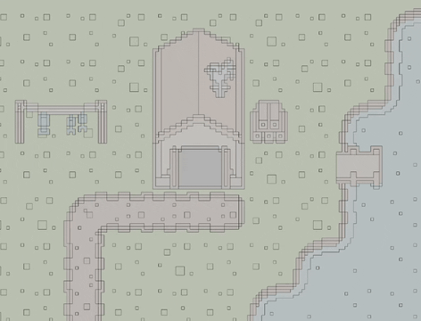

# Pixel Coloring Game
A simple pixel-art paint-by-number game written in Bevy

## Usage
Put an image named `input.png` in the working directory of the game. This is probably the directory the binary is in, or in the root of the project.

